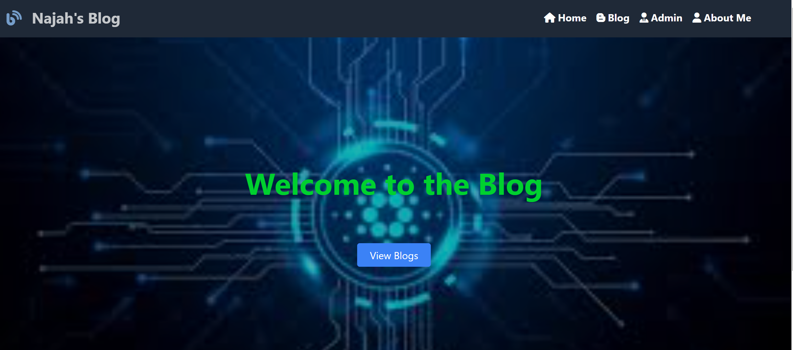
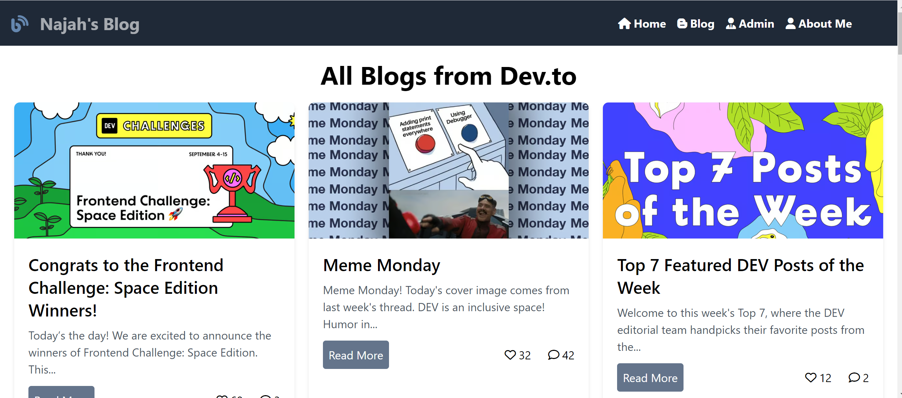
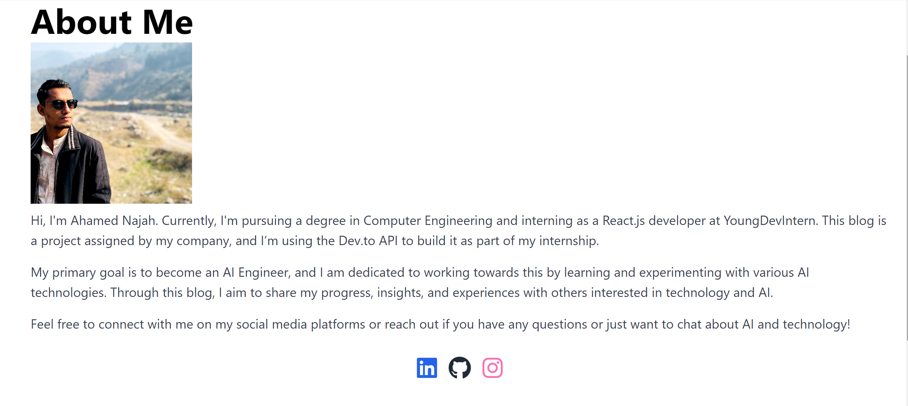

[](https://app.netlify.com/sites/najahblog/deploys)
# Najah's Blog

This is **Najah's Blog**, a React-based platform created as part of my internship project. The blog fetches data from the **Dev.to API** to display articles dynamically. It showcases my skills in frontend development using React.js, TailwindCSS, and API integration.

## Screenshots

1. **Home Page**: 
2. **Blog List**: 
3. **About Page**: 

## Features

- **Home Page**: A welcome page with a brief introduction and navigation to view the blog list.
- **Blog List**: Fetches and displays blogs from the Dev.to API, with options to view details.
- **Admin Side**: A simple admin panel for managing the blog posts (without actual functionality for creating or deleting posts, as this is not an official blog management system).
- **About Page**: Information about me, my goals, and a way to connect via social media.

## Technologies Used

- **React.js**: Frontend library for building user interfaces.
- **TailwindCSS**: Utility-first CSS framework for styling.
- **Axios**: For making API requests.
- **React Router**: For handling page navigation.
- **FontAwesome Icons**: For adding icons.

## API

The blog data is fetched from the [Dev.to API](https://dev.to/api/articles), which provides various articles on development topics.

## Installation and Setup

1. **Clone the repository:**
   ```bash
   git clone https://github.com/yourusername/najah-blog.git
   cd najah-blog
2.**Install dependencies:**

    npm install
3.**Start the development server:**

    npm run dev
